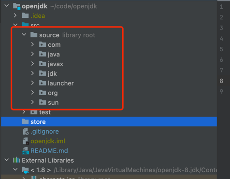
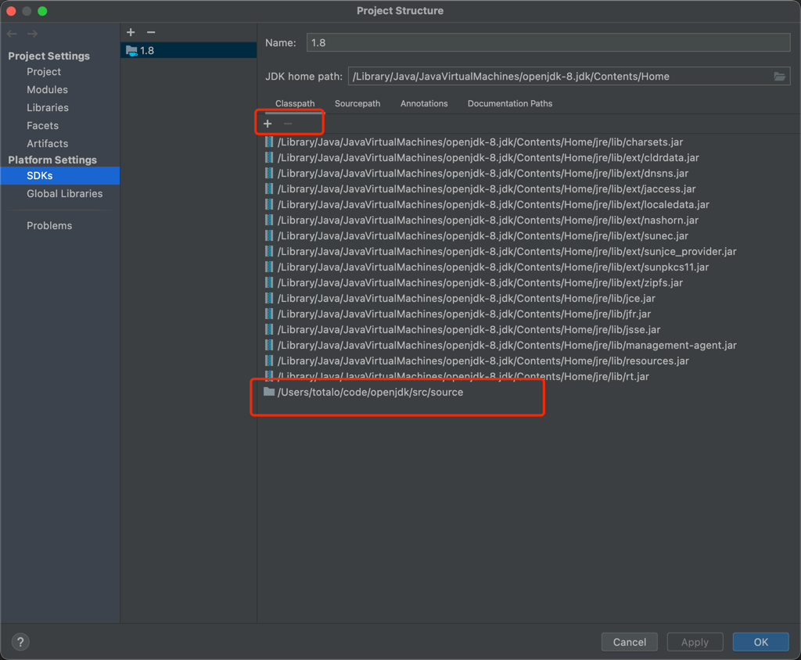
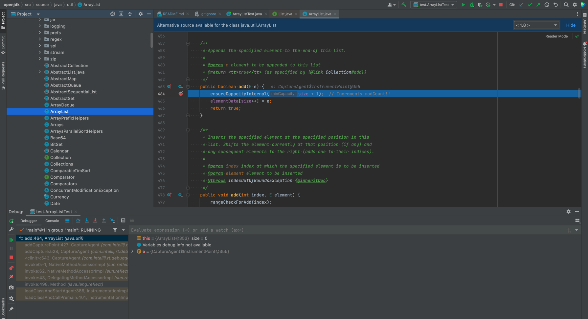

### jdk source read (base on openjdk1.8)

#### User Guide

1、Copy the src.zip file in the jdk environment to the source file

2、Add the lib of the corresponding directory to the sdk

3、Happy to debugging

#### On the step:

1、java.lang

2、java.util

3、java.util.concurrent

4、java.io

5、java.nio

6、java.lang.annotation

7、java.lang.reflect

8、java.util.function +java.util.stream

9、java.time

10、java.math

11、java.net

#### One more things:

1、rm `com.sun` and `sun` package, Compilation may fail due to missing dependencies.